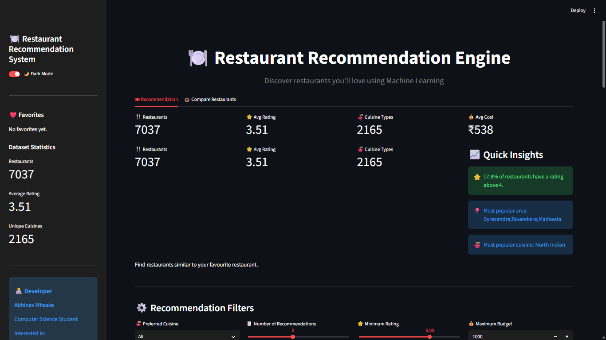
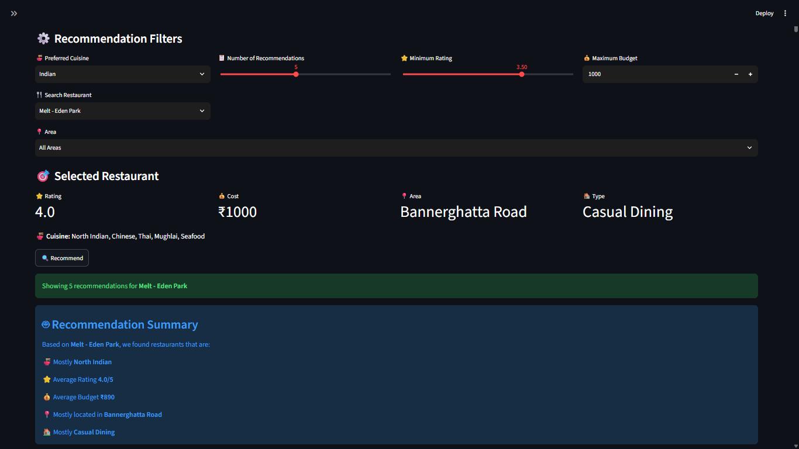
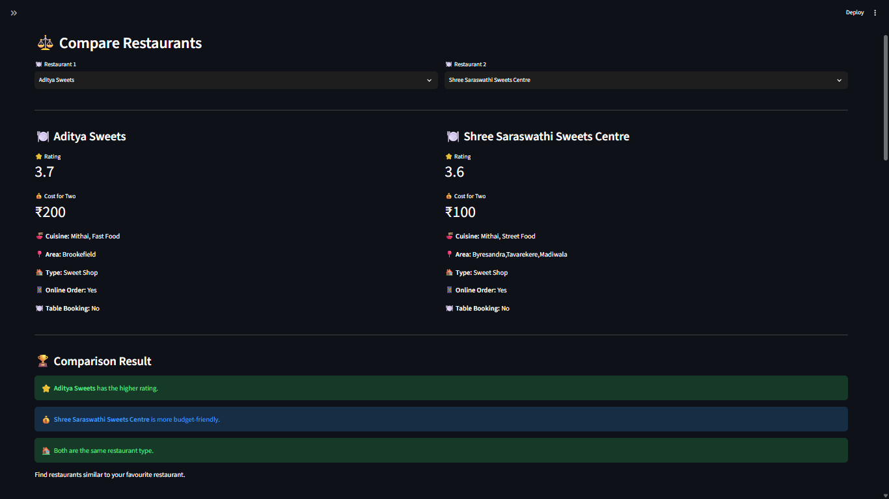
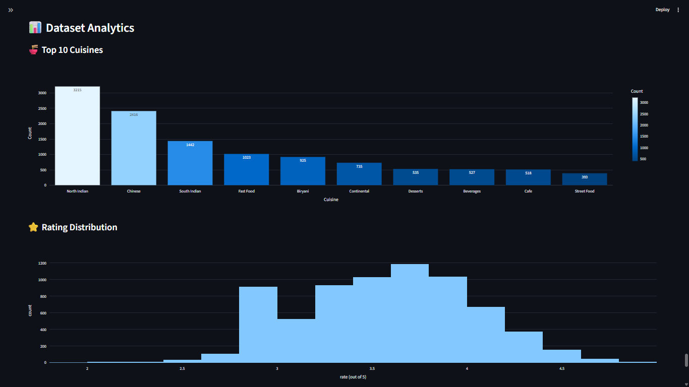

# 🍽️ Restaurant Recommendation System

A Machine Learning powered Restaurant Recommendation System built using **Python**, **Scikit-Learn**, **Pandas**, **Plotly**, and **Streamlit**.

The application recommends restaurants based on cuisine similarity while also considering rating, budget, restaurant type, and location through a hybrid recommendation approach.

---

## 🚀 Live Demo

Coming Soon (Streamlit Cloud)

---

## 📸 Screenshots

### 🏠 Home Page



---

### 🍽️ Recommendations



---

### ⚖️ Restaurant Comparison



---

### 📊 Analytics Dashboard



---

## ✨ Features

- 🍽️ Content-Based Recommendation Engine
- 🤖 Hybrid Recommendation System
- 📊 Interactive Analytics Dashboard
- ⭐ Rating & Budget Filters
- 📍 Area Filter
- 🍜 Cuisine Filter
- ⚖️ Restaurant Comparison
- ❤️ Favorites
- 📥 Download Recommendations as CSV
- 📈 Recommendation Summary
- 🌙 Dark Mode

---

## 🧠 Machine Learning

The recommendation engine combines multiple techniques:

- TF-IDF Vectorization
- Cosine Similarity
- Rating Weightage
- Budget Similarity
- Restaurant Type Matching
- Area Similarity

Final recommendations are generated using a weighted hybrid scoring algorithm.

---

## 🛠️ Technologies Used

- Python
- Pandas
- NumPy
- Scikit-Learn
- Plotly
- Streamlit

---

## 📂 Project Structure

```text
restaurant-recommendation-system/
│
├── app.py
├── requirements.txt
├── README.md
├── data/
├── screenshots/
└── src/
```

---

## ⚙️ Installation

Clone the repository

```bash
git clone https://github.com/YOUR_USERNAME/restaurant-recommendation-system.git
```

Move into the project

```bash
cd restaurant-recommendation-system
```

Install dependencies

```bash
pip install -r requirements.txt
```

Run the application

```bash
streamlit run app.py
```

---

## 🎯 Future Improvements

- Google Maps Integration
- Restaurant Images API
- User Authentication
- Collaborative Filtering
- Deep Learning Recommendation Models
- Mobile Responsive UI

---

## 👨‍💻 Author

**Abhinav Mhaske**

Computer Science Engineering Student

Interested in

- Machine Learning
- Cybersecurity
- Full Stack Development

---

## ⭐ If you like this project

Please consider giving it a ⭐ on GitHub.